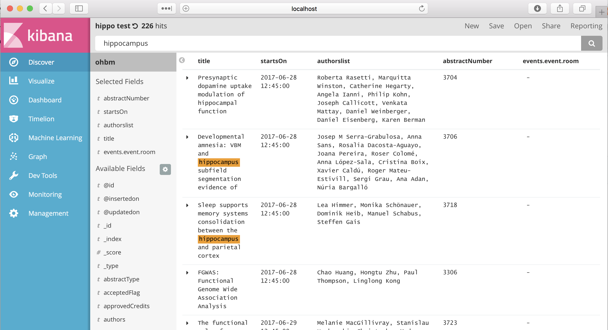

In this fork of Vanessa Sochat's Python API for the OHBM abstract database we have added a Jupityer notebook that dumps the entire abstracts and events database into a JSON file then loads that JSON file into Elastic Search for easy and fleixible searching.

# Instructions
* Make sure you have installed [Docker](http://docker.com), Anaconda, Jupyter
* Clone this repo
* Compose a set of docker containers using the included docker-compose.yml file. (More details here: https://www.elastic.co/blog/releasing-beta-version-of-elastic-docker-images)
* Open doc/ohbm-abstract-search.ipynb in Jupyter
* Run all of the cells to retrieve and import the JSON into Elastic Search
* Open http://localhost:5601/ in your browser and enjoy unrestricted searching bliss

